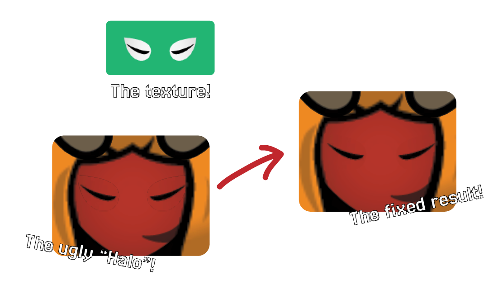

<div align="center">


Eliminate the ugly "White Halo" artifacts from your Unity textures.

[](https://fixmyhalo.vercel.app/)
[](https://github.com/Azganoth/fix-my-halo/releases)



</div>

## 🧐 The Problem

In game engines some texture filtering tecniques cause the textures to create a white/black halo around themselves. This happens because the GPU samples the pixels at the edge with their transparent neighbors to create a smooth transition, when the neighbor pixels are saved as **transparent white** (255, 255, 255, 0) or **transparent black** (0, 0, 0, 0) it creates a strong contrast and results in rendering a faint outline around your sprite.

## 🛠 The Solution

**FixMyHalo** is a high-performance tool written in **Rust** that performs **Texture Dilation** (Alpha Bleeding).

This tool spreads the color of the edge pixels into the adjacent transparent areas while preserving their transparency. When the GPU samples the edge, it now finds the &quot;bled&quot; color instead of white, resulting in a perfect, clean transition.

## 🚀 Usage

### 🌐 Web Version

No installation required. Runs entirely in your browser using **WebAssembly (Wasm)** for native performance.

1. Go to [**Fix My Halo**](https://fixmyhalo.vercel.app/).
2. Drag & drop your PNGs.
3. Get the fixed versions instantly.

### 💻 CLI Tool

Ideal for modders batch-processing hundreds of textures at once. Supports parallel processing, recursion, and multiple file formats.

**Installation:**

1. Download `fixmyhalo.exe` (Windows x64) from the
   [**Releases Page**](https://github.com/Azganoth/fix-my-halo/releases).
2. Place it in your folder (or add to PATH).
3. Open a terminal where it is located and execute it with the desired parameters.

**Usage:**

```powershell
# Basic usage (Saves to "fixed/" folder next to input)
./fixmyhalo "Textures/Player.png"

# Batch process an entire folder recursively
./fixmyhalo "C:/MyMod/Textures" --recursive

# Overwrite original files (In-place)
./fixmyhalo "C:/MyMod/Textures" --recursive --in-place

# Use Glob patterns (e.g. process only PNGs)
./fixmyhalo "assets/**/*.png" --padding 16

# Specify a custom output directory
./fixmyhalo "input/" --output "C:/Output/FixedTextures"
```

## 🛠 Development

### Prerequisites

- [Node.js](https://nodejs.org/)
- [Rust](https://www.rust-lang.org/)
- [`wasm-pack`](https://rustwasm.github.io/wasm-pack/installer/) (`cargo install wasm-pack`)

### 🌐 Web Development

To start the development server with Hot Module Replacement (HMR) for both React and Rust (via Wasm):

```bash
pnpm dev
```

This runs a watcher that automatically recompiles the Rust core whenever you make changes in `core/`.

### 💻 CLI Development

You can run the CLI directly from the source without building a standalone executable:

```bash
pnpm test:cli -- ./test-assets/in --output ./test-assets/out --recursive
```

_Note: Use `--` to separate Cargo arguments from the CLI's own arguments._

### 🧪 Testing

#### Unit Tests (Core Logic)

To test the image processing algorithms in the Rust core:

```bash
pnpm test:cli-unit
```

#### Linting & Formatting

```bash
pnpm lint     # Runs ESLint & TSC
pnpm format   # Runs Prettier
```

### 📦 Building for Production

- **Web:** `pnpm build` (Compiles Wasm and builds the Vite app)
- **CLI:** `pnpm run build:cli` (Compiles the native executable to `dist-cli/`)

## 📜 License

MIT License. Free to use for personal and commercial projects.
